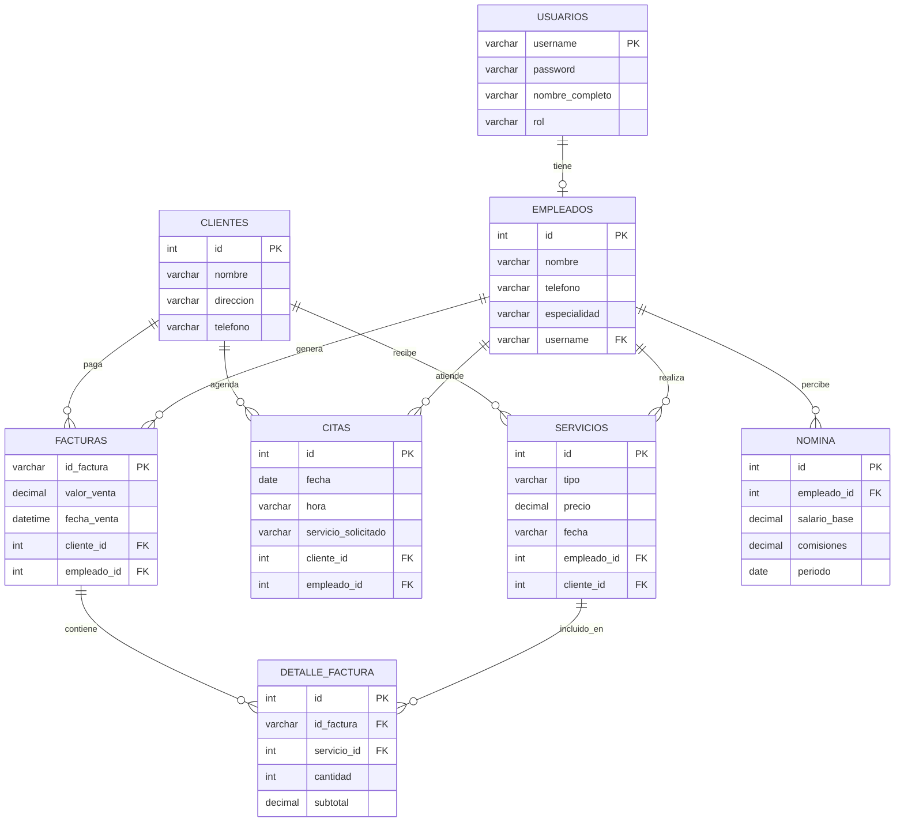

# Sistema de Gestión para Salón de Belleza AREMI

## Descripción del Proyecto
Sistema completo de gestión empresarial (ERP) desarrollado en Java para administrar las operaciones del Salón de Belleza Aremi. Incluye gestión de clientes, citas, servicios, pagos, facturación y nómina.

**Versión:** 2.0
**Lenguaje:** Java
**Framework GUI:** Swing
**Base de Datos:** MySQL

---

## Características Principales

### 1. Sistema de Autenticación y Roles
- Login seguro con contraseñas hasheadas (SHA-256)
- Dos roles de usuario: **Administrador** y **Empleado**
- Control de acceso por permisos según rol
- Gestión de sesiones con `SeguridadManager`

**Archivos:**
- `LoginSystemAremi.java` - Interfaz de login
- `SeguridadManager.java` - Gestión centralizada de seguridad y roles

### 2. Gestión de Clientes
- Registro, edición y eliminación de clientes
- Almacenamiento de datos: nombre, dirección, teléfono
- Búsqueda y visualización de clientes

**Archivos:**
- `Cliente.java` - Modelo de datos
- `InterfazClientes.java` - GUI de gestión

### 3. Agenda de Citas
- Programación de citas con fecha y hora
- Selección de servicios disponibles
- Asociación de citas con clientes

**Archivos:**
- `AgendarCitaGUI.java` - Interfaz de agenda
- `DatabaseConnection.java` - Conexión y guardado de citas

### 4. Gestión de Servicios
- Registro de servicios realizados
- Cálculo automático de comisiones (20%)
- Asignación de empleadas por servicio
- Reportes de ingresos por empleada

**Archivos:**
- `Servicio.java` - Modelo de servicios
- `SalonBelleza.java` - Registro y resumen financiero

### 5. Sistema de Nómina ⭐ NUEVO
- Cálculo automático de comisiones por empleada (20% de servicios)
- Configuración de salario base y bonificaciones
- Reportes mensuales detallados
- Resumen financiero general
- Generación de reportes por periodo
- **Acceso:** Solo administradores

**Archivos:**
- `NominaGUI.java` - Interfaz de gestión de nómina

**Características:**
- Filtrado por mes y año
- Visualización de:
  - Servicios realizados por empleada
  - Ingresos generados
  - Comisión calculada (20%)
  - Salario base
  - Bonificaciones
  - Total a pagar
- Exportación de reportes a consola

### 6. Sistema de Pagos y Facturación
- Múltiples métodos de pago: efectivo, tarjeta, transferencia
- Generación de facturas en PDF con logo
- Búsqueda de facturas por nombre o teléfono
- Historial de transacciones

**Archivos:**
- `Pago.java` - Procesamiento de pagos
- `Facturas.java` - Generación de facturas PDF
- `PagoDetailsDialog.java` - Detalles de pago

### 7. Gestión de Gastos
- Registro de gastos operacionales
- Seguimiento por concepto y fecha
- Cálculo de beneficio neto (ingresos - gastos)

**Archivos:**
- `Gasto.java` - Modelo de gastos

---

## Pruebas Unitarias ⭐ NUEVO

El proyecto incluye pruebas para validar la lógica de negocio:

### TestSeguridad.java
Valida:
- ✓ Generación de hash SHA-256
- ✓ Autenticación de administradores
- ✓ Autenticación de empleados
- ✓ Sistema de permisos por rol
- ✓ Cierre de sesión

**Ejecutar pruebas:**
```bash
java TestSeguridad
```

---

## Estructura del Proyecto

```
Proyecto-Integrador/
├── src/
│   ├── MainApplication.java          # Aplicación principal con menú integrado
│   ├── LoginSystemAremi.java         # Sistema de login
│   ├── SeguridadManager.java         # ⭐ Gestión de seguridad y roles
│   │
│   ├── # Modelos
│   ├── Cliente.java                  # Modelo de cliente
│   ├── Usuario.java                  # Modelo de usuario
│   ├── Servicio.java                 # Modelo de servicio
│   ├── Gasto.java                    # Modelo de gasto
│   │
│   ├── # Interfaces Gráficas
│   ├── AgendarCitaGUI.java           # GUI de agenda de citas
│   ├── InterfazClientes.java         # GUI de gestión de clientes
│   ├── SalonBelleza.java             # GUI de servicios y gastos
│   ├── NominaGUI.java                # ⭐ GUI de gestión de nómina
│   ├── Pago.java                     # GUI de pagos
│   ├── PagoDetailsDialog.java        # Diálogo de detalles de pago
│   │
│   ├── # Utilidades
│   ├── DatabaseConnection.java       # Conexión a base de datos
│   ├── Facturas.java                 # Generación de facturas PDF
│   │
│   └── # Pruebas
│       └── TestSeguridad.java        # ⭐ Tests de seguridad
│
├── lib/                              # Librerías externas (MySQL, iText)
├── out/                              # Archivos compilados
└── README.md                         # Este archivo
```

---

## Diagrama Entidad-Relación



### Descripción de Relaciones

| Relación | Cardinalidad | Descripción |
|----------|--------------|-------------|
| USUARIOS → EMPLEADOS | 1:0..1 | Un usuario puede ser un empleado |
| CLIENTES → CITAS | 1:N | Un cliente agenda múltiples citas |
| CLIENTES → SERVICIOS | 1:N | Un cliente recibe múltiples servicios |
| CLIENTES → FACTURAS | 1:N | Un cliente tiene múltiples facturas |
| EMPLEADOS → CITAS | 1:N | Un empleado atiende múltiples citas |
| EMPLEADOS → SERVICIOS | 1:N | Un empleado realiza múltiples servicios |
| EMPLEADOS → FACTURAS | 1:N | Un empleado genera múltiples facturas |
| EMPLEADOS → NOMINA | 1:N | Un empleado tiene registros de nómina |
| FACTURAS → DETALLE_FACTURA | 1:N | Una factura tiene múltiples detalles |
| SERVICIOS → DETALLE_FACTURA | 1:N | Un servicio puede estar en múltiples facturas |

---

## Configuración de Base de Datos

### Requisitos
- MySQL Server 8.0 o superior
- Base de datos: `salon_aremi`

### Tablas Necesarias

```sql
-- Base de datos principal
CREATE DATABASE IF NOT EXISTS salon_aremi;
USE salon_aremi;

-- Tabla de usuarios
CREATE TABLE usuarios (
    id INT PRIMARY KEY AUTO_INCREMENT,
    username VARCHAR(50) UNIQUE NOT NULL,
    password VARCHAR(255) NOT NULL,  -- Hash SHA-256
    nombre_completo VARCHAR(100) NOT NULL,
    rol VARCHAR(20) NOT NULL         -- 'administrador' o 'empleado'
);

-- Tabla de servicios
CREATE TABLE servicios (
    id INT PRIMARY KEY AUTO_INCREMENT,
    tipo VARCHAR(100) NOT NULL,
    precio DECIMAL(10,2) NOT NULL,
    empleada VARCHAR(100) NOT NULL,
    fecha VARCHAR(20) NOT NULL
);

-- Tabla de gastos
CREATE TABLE gastos (
    id INT PRIMARY KEY AUTO_INCREMENT,
    concepto VARCHAR(200) NOT NULL,
    monto DECIMAL(10,2) NOT NULL,
    fecha VARCHAR(20) NOT NULL
);

-- Tabla de citas
CREATE TABLE citas (
    id INT PRIMARY KEY AUTO_INCREMENT,
    nombre VARCHAR(100) NOT NULL,
    telefono VARCHAR(20),
    servicio VARCHAR(100),
    fecha DATE,
    hora VARCHAR(10)
);

-- Tabla de facturas
CREATE TABLE facturas (
    id_factura VARCHAR(20) PRIMARY KEY,
    usuario VARCHAR(100),
    telefono VARCHAR(20),
    valor_venta DECIMAL(10,2),
    nombre_vendedor VARCHAR(100),
    fecha_venta DATETIME DEFAULT CURRENT_TIMESTAMP
);

-- Tabla de clientes
CREATE DATABASE IF NOT EXISTS gestion_clientes;
USE gestion_clientes;

CREATE TABLE clientes (
    id INT PRIMARY KEY AUTO_INCREMENT,
    nombre VARCHAR(100) NOT NULL,
    direccion VARCHAR(200),
    telefono VARCHAR(20)
);
```

### Usuarios de Prueba

```sql
USE salon_aremi;

-- Insertar usuario administrador
-- Usuario: fernanda, Contraseña: fernanda123
INSERT INTO usuarios (username, password, nombre_completo, rol) VALUES
('fernanda', '8d969eef6ecad3c29a3a629280e686cf0c3f5d5a86aff3ca12020c923adc6c92', 'Fernanda Administrador', 'administrador');

-- Insertar usuario empleado
-- Usuario: empleada1, Contraseña: emp123
INSERT INTO usuarios (username, password, nombre_completo, rol) VALUES
('empleada1', '6ca13d52ca70c883e0f0bb101e425a89e8624de51db2d2392593af6a84118090', 'María González', 'empleado');
```

---

## Instalación y Ejecución

### Requisitos Previos
1. JDK 8 o superior
2. MySQL Server
3. Librerías externas:
   - MySQL Connector/J (JDBC)
   - iText PDF (para generación de facturas)
   - JUnit 4 (para pruebas)

### Pasos de Instalación

1. **Clonar el repositorio**
```bash
git clone <url-del-repositorio>
cd Proyecto-Integrador
```

2. **Configurar la base de datos**
   - Crear las bases de datos y tablas (ver sección anterior)
   - Actualizar credenciales en los archivos si es necesario:
     - Usuario: `root`
     - Contraseña: `missgarro234`
     - Host: `127.0.0.1:3306`

3. **Compilar el proyecto**
```bash
javac -d out -cp "lib/*" src/*.java
```

4. **Ejecutar la aplicación**
```bash
java -cp "out:lib/*" MainApplication
```

### Credenciales de Acceso

**Administrador:**
- Usuario: `fernanda`
- Contraseña: `fernanda123`
- Permisos: Acceso completo a todas las funcionalidades

**Empleado:**
- Usuario: `empleada1`
- Contraseña: `emp123`
- Permisos: Citas, clientes, servicios, pagos (sin nómina)

---

## Control de Acceso por Roles

### Permisos de Administrador
✓ Agendar citas
✓ Gestión de clientes
✓ Registrar servicios
✓ Registrar pagos
✓ Generar facturas
✓ **Ver nómina y reportes**
✓ **Gestionar usuarios**

### Permisos de Empleado
✓ Agendar citas
✓ Gestión de clientes
✓ Registrar servicios
✓ Registrar pagos
✓ Generar facturas
❌ Ver nómina y reportes
❌ Gestionar usuarios

---

## Funcionalidades Clave

### Cálculo de Nómina
El sistema calcula automáticamente:

**Fórmula:**
```
Total a Pagar = Salario Base + Comisión + Bonificación
Comisión = Suma(Precio Servicios) × 20%
```

**Ejemplo:**
- Empleada: María González
- Servicios realizados: 15
- Ingresos generados: $750,000
- Comisión (20%): $150,000
- Salario base: $1,300,000
- Bonificación: $50,000
- **Total a pagar: $1,500,000**

---

## Arquitectura del Sistema

### Patrón de Diseño
El proyecto sigue principios de:
- **MVC** (Modelo-Vista-Controlador) simplificado
- **Separación de responsabilidades**
- **Singleton** para SeguridadManager

### Flujo de Autenticación
```
1. Usuario ingresa credenciales en LoginSystemAremi
2. LoginSystemAremi hashea la contraseña (SHA-256)
3. Consulta base de datos para validar
4. Si es exitoso:
   - Establece sesión en SeguridadManager
   - Abre MainApplication
5. MainApplication verifica permisos para cada acción
```

### Conexión a Base de Datos
Cada módulo maneja su propia conexión pero usando las mismas credenciales:
- Conexiones se cierran automáticamente con try-with-resources
- PreparedStatements para prevenir SQL Injection

---

## Mejoras Implementadas (Versión 2.0)

### ✨ Nuevas Funcionalidades
1. **Sistema de Nómina** con reportes detallados
2. **Control de acceso por roles** centralizado
3. **Pruebas de seguridad** automatizadas
4. **Integración completa** en menú principal

### 🔒 Seguridad
- Hash SHA-256 para contraseñas (apropiado para proyecto académico)
- Sistema de permisos por rol
- Validación de acceso en cada módulo sensible

### 📊 Reportes
- Reportes de nómina por periodo
- Resumen financiero consolidado

---

## Escalabilidad y Mantenimiento

### Agregar Nuevos Módulos
Para agregar un nuevo módulo:

1. Crear la clase modelo en `src/`
2. Crear la GUI correspondiente
3. Agregar botón en `MainApplication.java`
4. Configurar permisos en `SeguridadManager.java`
5. Actualizar base de datos si es necesario

### Agregar Nuevos Roles
```java
// En SeguridadManager.java
public static final String ROL_SUPERVISOR = "supervisor";

// Actualizar método tienePermiso()
public static boolean tienePermiso(String accion) {
    if (esAdministrador()) return true;
    if (esSupervisor()) {
        // Definir permisos específicos
    }
    // ...
}
```

---

## Tecnologías Utilizadas

| Tecnología | Uso |
|------------|-----|
| Java 8+ | Lenguaje principal |
| Swing | Interfaz gráfica |
| MySQL | Base de datos |
| JDBC | Conexión a BD |
| iText PDF | Generación de facturas |
| JUnit 4 | Pruebas unitarias |
| SHA-256 | Hash de contraseñas |

---

## Autor

**Sistema Aremi v2.0**
Proyecto de Gestión para Salón de Belleza
Desarrollado como proyecto integrador académico

---

## Licencia

Este proyecto es de uso académico.

---

## Soporte

Para reportar problemas o sugerencias:
1. Revisar la documentación en este README
2. Verificar logs en consola
3. Comprobar conexión a base de datos

---

## Notas Importantes

- **Contraseñas:** Se almacenan hasheadas con SHA-256
- **Base de datos:** Configurar antes del primer uso
- **Nómina:** Los porcentajes son configurables en la interfaz
- **Roles:** Los permisos están definidos en `SeguridadManager.java`

---

**¡Proyecto completado exitosamente!** 🎉